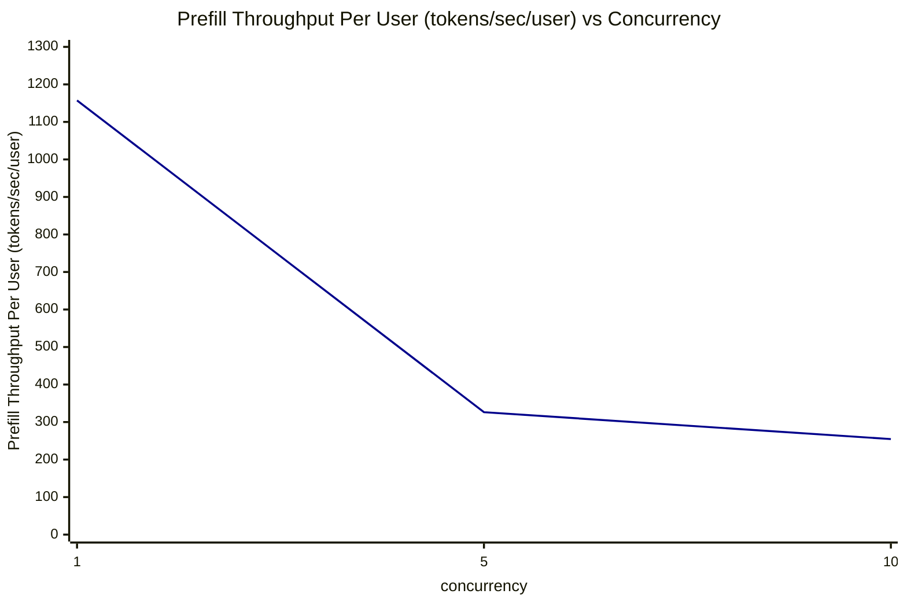
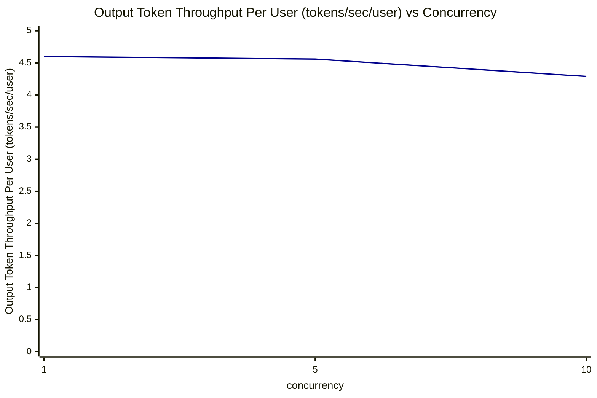
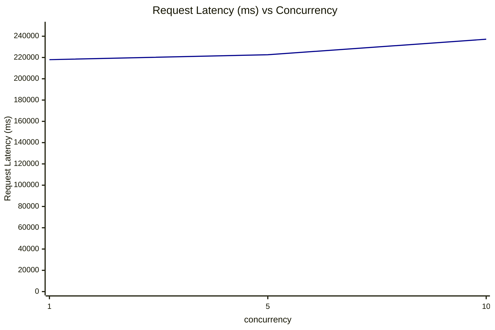

# Qwen3.6-27B 性能测试报告 (ISL1000-OSL1000)

## 一、部署文档

### 1.1 启动推理服务 (Docker 方式)

使用 NVIDIA 官方 vLLM 镜像启动容器化推理服务：

```bash
docker run -it --rm \
  --gpus all \
  -p 8001:8000 \
  -v /data/models:/data/models \
  nvcr.io/nvidia/vllm:26.07-py3 \
  vllm serve \
    --model /data/models/Qwen3.6-27B \
    --served-model-name Qwen3.6-27B \
    --host 0.0.0.0 \
    --port 8000 \
    --tensor-parallel-size 1 \
    --max-model-len 100000 \
    --gpu-memory-utilization 0.7
```

#### 启动参数说明

| 参数                              | 说明                         |
| ------------------------------- | -------------------------- |
| `--gpus all`                    | 使用宿主机所有 GPU                |
| `-p 8001:8000`                  | 将容器内 8000 端口映射到宿主机 8001 端口 |
| `-v /data/models:/data/models`  | 挂载本地模型目录到容器内               |
| `nvcr.io/nvidia/vllm:26.07-py3` | NVIDIA 官方 vLLM 镜像版本        |
| `--model`                       | 模型权重路径                     |
| `--served-model-name`           | 对外暴露的模型名称                  |
| `--host 0.0.0.0`                | 监听所有网卡                     |
| `--port 8000`                   | 容器内服务端口                    |
| `--tensor-parallel-size 1`      | 张量并行度为 1（单卡）               |
| `--max-model-len 100000`        | 最大模型上下文长度 100K             |
| `--gpu-memory-utilization 0.7`  | GPU 显存利用率上限 70%            |

### 1.2 接口调用示例

服务启动后，可通过 OpenAI 兼容的 `/v1/chat/completions` 接口发起请求：

```bash
curl -X POST http://10.10.207.51:8001/v1/chat/completions \
  -H "Content-Type: application/json" \
  -d '{
    "model": "Qwen3.6-27B",
    "messages": [
      {"role": "user", "content": [
        {"type": "text", "text": "你好"}
      ]}
    ],
    "max_tokens": 150,
    "stream": false
  }'
```

#### 请求参数说明

| 参数           | 说明                                |
| ------------ | --------------------------------- |
| `model`      | 必须与服务启动时 `--served-model-name` 一致 |
| `messages`   | OpenAI 格式的对话消息列表                  |
| `max_tokens` | 单次生成的最大 token 数                   |
| `stream`     | 是否使用流式返回，`false` 表示一次性返回          |

### 1.3 访问地址

- 服务地址：`http://10.10.207.51:8001`
- 接口路径：`/v1/chat/completions`
- 交互式 API 文档：`http://10.10.207.51:8001/docs`（vLLM 默认提供）

---

## 二、测试环境说明

- 模型：Qwen3.6-27B
- 输入序列长度 (ISL)：1000 tokens
- 输出序列长度 (OSL)：1000 tokens
- 测试场景：openai-chat 接口
- 并发数：1 / 5 / 10

## 三、性能指标汇总表

| concurrency | Input Sequence Length (tokens) | Output Sequence Length (tokens) | Time to First Token (ms) | Prefill Throughput Per User (tokens/sec/user) | Output Token Throughput Per User (tokens/sec/user) | Request Latency (ms) |
|:-----------:|:------------------------------:|:-------------------------------:|:------------------------:|:---------------------------------------------:|:--------------------------------------------------:|:--------------------:|
| 1           | 1000.00                        | 1000.00                         | 864.10                   | 1157.31                                       | 4.60                                               | 217955.46            |
| 5           | 1000.00                        | 999.76                          | 3331.76                  | 326.29                                        | 4.56                                               | 222586.09            |
| 10          | 1000.00                        | 999.88                          | 4419.79                  | 254.62                                        | 4.29                                               | 237170.74            |

> 数据来源：各并发目录下 `profile_export_aiperf.csv` 文件中对应 Metric 的 avg 值。

## 四、性能折线图

### 1. Time to First Token (ms) vs 并发数

```mermaid
---
config:
  xyChart:
    width: 900
    height: 600
  themeVariables:
    xyChart:
      plotColorPalette: "#00008B"
---
xychart-beta
    title "Time to First Token (ms) vs Concurrency"
    x-axis "concurrency" [1, 5, 10]
    y-axis "Time to First Token (ms)" 0 --> 5000
    line [864.10, 3331.76, 4419.79]
```

> 折线颜色：深蓝色 (#00008B)

### 2. Prefill Throughput Per User (tokens/sec/user) vs 并发数



> 折线颜色：深蓝色 (#00008B)

### 3. Output Token Throughput Per User (tokens/sec/user) vs 并发数



> 折线颜色：深蓝色 (#00008B)

### 4. Request Latency (ms) vs 并发数



> 折线颜色：深蓝色 (#00008B)

## 五、结论简析

- **Time to First Token (TTFT)**：随并发数增加显著上升，并发1时约864ms，并发10时升至约4420ms，约为单并发时的5.1倍，说明 prefill 阶段在并发下出现排队等待。
- **Prefill Throughput Per User**：随并发数增加明显下降，从单并发的1157.31降至并发10的254.62，反映每个用户分到的 prefill 计算资源被并发请求稀释。
- **Output Token Throughput Per User**：从4.60缓慢下降至4.29，下降幅度较小，说明 decode 阶段单用户吞吐受并发影响相对有限。
- **Request Latency**：从约218s增至约237s，增幅约8.8%，整体端到端延迟随并发温和上升。
