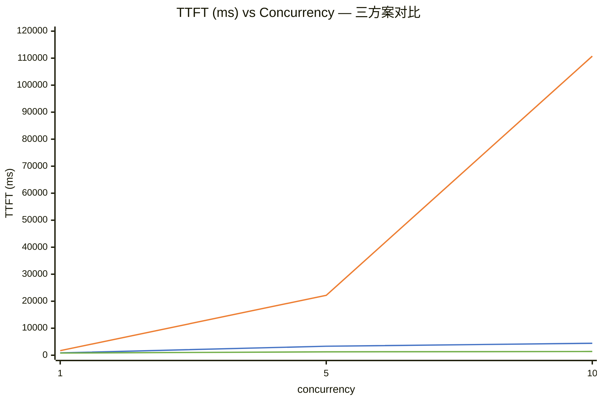
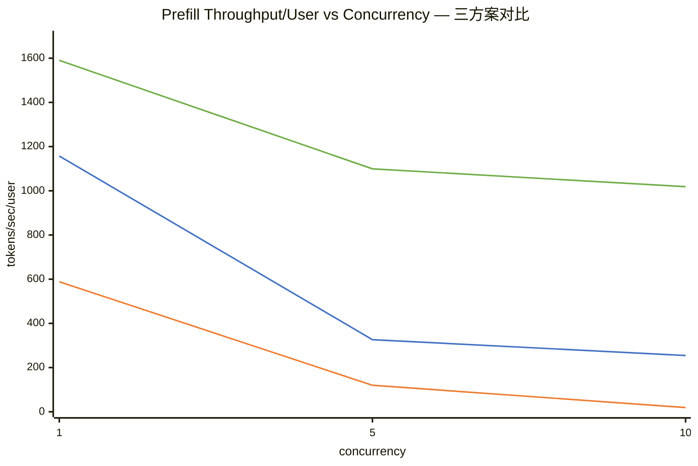
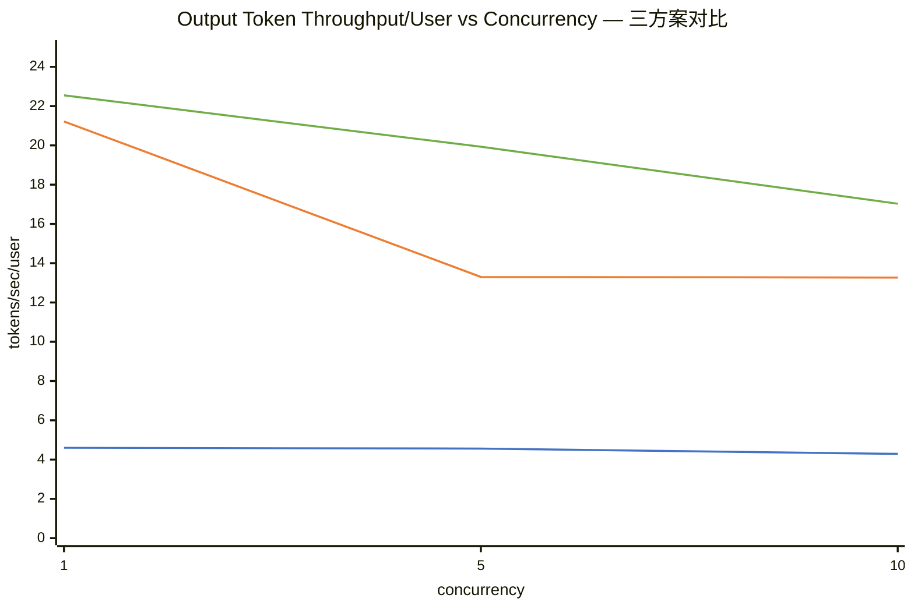
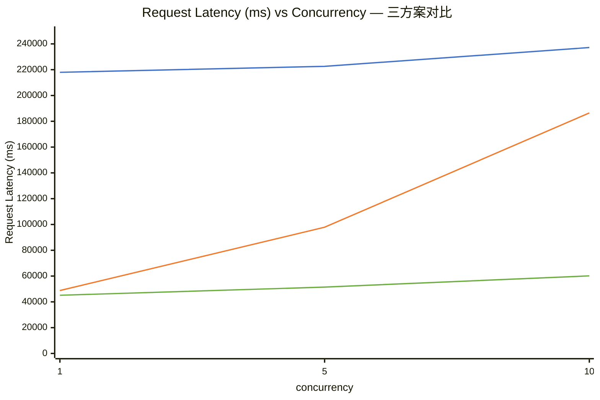

# Qwen3.6-27B 三方案性能对比分析报告

> 测试模型：Qwen3.6-27B（27B 参数）
> 测试场景：ISL=1000 / OSL=1000，openai-chat + streaming
> 并发档位：1 / 5 / 10
> 测试工具：`aiperf profile`
> 报告生成时间：2026-08-27

---

## 目录

1. [参与对比方案](#一参与对比方案)
2. [核心指标总览](#二核心指标总览)
3. [Time to First Token (TTFT) 对比](#三time-to-first-token-ttft-对比)
4. [Prefill Throughput Per User 对比](#四prefill-throughput-per-user-对比)
5. [Output Token Throughput Per User 对比](#五output-token-throughput-per-user-对比)
6. [Request Latency 对比](#六request-latency-对比)
7. [综合结论与方案选型建议](#七综合结论与方案选型建议)

---

## 一、参与对比方案

| 方案  | 简称                   | 量化             | 推理框架                                   | 投机解码 (MTP)                       | 模型权重                                  |
|:---:|:--------------------:|:--------------:|:--------------------------------------:|:--------------------------------:|:------------------------------------- |
| A   | **vLLM-BF16**        | 无（BF16 原版）     | vLLM (`nvcr.io/nvidia/vllm:26.07-py3`) | 否                                | `/data/models/Qwen3.6-27B`            |
| B   | **llama.cpp-Q4-MTP** | Q4_K_XL (GGUF) | llama.cpp (`llama-server`)             | 是（draft-mtp, n=2）                | `unsloth/Qwen3.6-27B-UD-Q4_K_XL.gguf` |
| C   | **vLLM-NVFP4-MTP**   | NVFP4          | vLLM (`nvcr.io/nvidia/vllm:26.07-py3`) | 是（mtp, num_speculative_tokens=2） | `unsloth/Qwen3.6-27B-NVFP4`           |

**关键说明：**

- 三方案均单卡推理（`tensor-parallel-size 1` / `-ngl 999`）。
- 测试参数完全一致（ISL=1000、OSL=1000、`num-requests=并发×5`、`ignore_eos=true`、`temperature=0.0`、`min_tokens=40`、streaming）。
- 方案 A 为基线（BF16 原版 vLLM，无投机解码）；方案 B、C 引入量化 + MTP 投机解码。

---

## 二、核心指标总览

### 2.1 Time to First Token (TTFT, ms) — 越小越好

| concurrency | A: vLLM-BF16 | B: llama.cpp-Q4-MTP | C: vLLM-NVFP4-MTP |
|:-----------:|:------------:|:-------------------:|:-----------------:|
| 1           | 864.10       | 1700.74             | **805.28**        |
| 5           | 3331.76      | 22172.50            | **1252.75**       |
| 10          | 4419.79      | 110737.94           | **1381.03**       |

### 2.2 Prefill Throughput Per User (tokens/sec/user) — 越大越好

| concurrency | A: vLLM-BF16 | B: llama.cpp-Q4-MTP | C: vLLM-NVFP4-MTP |
|:-----------:|:------------:|:-------------------:|:-----------------:|
| 1           | 1157.31      | 588.41              | **1590.24**       |
| 5           | 326.29       | 119.92              | **1099.39**       |
| 10          | 254.62       | 19.09               | **1018.55**       |

### 2.3 Output Token Throughput Per User (tokens/sec/user) — 越大越好

| concurrency | A: vLLM-BF16 | B: llama.cpp-Q4-MTP | C: vLLM-NVFP4-MTP |
|:-----------:|:------------:|:-------------------:|:-----------------:|
| 1           | 4.60         | 21.22               | **22.55**         |
| 5           | 4.56         | 13.30               | **19.93**         |
| 10          | 4.29         | 13.27               | **17.03**         |

### 2.4 Request Latency (ms) — 越小越好

| concurrency | A: vLLM-BF16 | B: llama.cpp-Q4-MTP | C: vLLM-NVFP4-MTP |
|:-----------:|:------------:|:-------------------:|:-----------------:|
| 1           | 217955.46    | 48777.68            | **45107.32**      |
| 5           | 222586.09    | 97870.27            | **51446.65**      |
| 10          | 237170.74    | 186461.69           | **60153.24**      |

> 每行加粗者为该指标该并发档位下的最优值。

---

## 三、Time to First Token (TTFT) 对比

> **图例说明**：
> 
> - 🔵 蓝色线：`A: vLLM-BF16`（BF16 原版，无 MTP）
> - 🟠 橙色线：`B: llama.cpp-Q4-MTP`（Q4_K_XL 量化 + MTP）
> - 🟢 绿色线：`C: vLLM-NVFP4-MTP`（NVFP4 量化 + MTP）

**分析：**

- **方案 C（vLLM-NVFP4-MTP）TTFT 全程最低**，并发 1 时 805 ms，并发 10 时仅 1381 ms，相比基线 A（并发 10 为 4420 ms）快约 **3.2 倍**。
- **方案 A（vLLM-BF16）次之**，TTFT 随并发温和增长（864→4420 ms，约 5.1 倍）。
- **方案 B（llama.cpp-Q4-MTP）TTFT 最差且急剧恶化**：并发 1 时 1701 ms（约为 C 的 2.1 倍），并发 5 时飙至 22173 ms，并发 10 时竟达 **110738 ms**（约为 C 的 80 倍）。这表明 llama.cpp 的 prefill 在并发场景下缺乏连续批处理（continuous batching）能力，请求在 prefill 阶段严重排队。

**结论：** prefill 阶段（首 token 延迟）方案 C 最优，方案 B 在并发下不可用。

---

## 四、Prefill Throughput Per User 对比

> **图例说明**：
> 
> - 🔵 蓝色线：`A: vLLM-BF16`（BF16 原版，无 MTP）
> - 🟠 橙色线：`B: llama.cpp-Q4-MTP`（Q4_K_XL 量化 + MTP）
> - 🟢 绿色线：`C: vLLM-NVFP4-MTP`（NVFP4 量化 + MTP）

**分析：**

- **方案 C 并发扩展性最佳**：并发 1 为 1590 tokens/s/user，并发 10 仍达 1019，仅下降约 36%；NVFP4 量化 + vLLM 连续批处理使其在高并发下仍保持高 prefill 吞吐。
- **方案 A 下降明显**：从 1157 降至 255（-78%），BF16 计算量大，并发时每用户分到的 prefill 算力被严重稀释。
- **方案 B 近乎崩塌**：从 588 跌至 19（-97%），再次印证 llama.cpp 无连续批处理，并发下 prefill 资源被串行化挤占。

**结论：** prefill 吞吐扩展性 C >> A >> B。

---

## 五、Output Token Throughput Per User 对比

> **图例说明**：
> 
> - 🔵 蓝色线：`A: vLLM-BF16`（BF16 原版，无 MTP）
> - 🟠 橙色线：`B: llama.cpp-Q4-MTP`（Q4_K_XL 量化 + MTP）
> - 🟢 绿色线：`C: vLLM-NVFP4-MTP`（NVFP4 量化 + MTP）

**分析：**

- **方案 C 单用户解码吞吐最高**：并发 1 为 22.55，并发 10 仍 17.03，MTP 投机解码（每步投机 2 token）+ NVFP4 量化带来显著加速。
- **方案 B 紧随 C**：并发 1 为 21.22，但并发 10 降至 13.27（-37%），MTP 加速明显但受框架并发能力拖累。
- **方案 A 解码吞吐异常低（仅 ~4.3-4.6）**：相比 B/C 低约 **4-5 倍**。原因推测：BF16 无量化 + 无 MTP，decode 阶段为纯自回归串行，单 token 计算开销大；且方案 A 的 Request Latency 高达 218s（详见下节），导致单用户有效 decode 吞吐被极长的总时长摊薄。

**结论：** 单用户 decode 吞吐 C ≥ B >> A。MTP 投机解码对 decode 阶段加速效果显著（B、C 均为 A 的 4-5 倍）。

---

## 六、Request Latency 对比

> **图例说明**：
> 
> - 🔵 蓝色线：`A: vLLM-BF16`（BF16 原版，无 MTP）
> - 🟠 橙色线：`B: llama.cpp-Q4-MTP`（Q4_K_XL 量化 + MTP）
> - 🟢 绿色线：`C: vLLM-NVFP4-MTP`（NVFP4 量化 + MTP）

**分析：**

- **方案 C 端到端延迟全程最低**：并发 1 为 45.1 s，并发 10 为 60.2 s（+33%），扩展性优秀。
- **方案 B 次之但高并发恶化快**：并发 1 为 48.8 s（与 C 接近），并发 10 飙至 186.5 s（约为 C 的 3.1 倍），TTFT 恶化直接拉高总延迟。
- **方案 A 延迟全程最高且几乎不随并发改善**：约 218-237 s，是 C 的 **4-5 倍**。这与其极低的 decode 吞吐（4.3 token/s）一致——1000 个输出 token 需 ~233 s，与实测延迟吻合，说明 A 的 decode 阶段是绝对瓶颈。

**结论：** 端到端延迟 C < B < A；方案 A 的 decode 效率是最大短板。

---

## 七、综合结论与方案选型建议

### 7.1 综合排名

| 指标              | 方案 A (vLLM-BF16) | 方案 B (llama.cpp-Q4-MTP) | 方案 C (vLLM-NVFP4-MTP) |
|:--------------- |:----------------:|:-----------------------:|:---------------------:|
| TTFT（低优先）       | 中                | 差（并发崩塌）                 | **优**                 |
| Prefill 吞吐      | 中                | 差                       | **优**                 |
| Decode 吞吐       | **差**            | 优                       | **优**                 |
| Request Latency | 差                | 中                       | **优**                 |
| 并发扩展性           | 中                | 差                       | **优**                 |
| 量化精度损失          | 无                | 中（Q4_K_XL）              | 中（NVFP4）              |
| 部署复杂度           | 低（官方镜像）          | 中（编译 llama.cpp）         | 低（官方镜像）               |

### 7.2 关键发现

1. **方案 C (vLLM-NVFP4-MTP) 全面领先**：在所有指标、所有并发档位下均为最优或接近最优。NVFP4 量化降低显存与计算开销，MTP 投机解码加速 decode，vLLM 连续批处理保障并发扩展性，三者协同使其在 TTFT、吞吐、延迟上均显著优于基线。
2. **MTP 投机解码对 decode 阶段加速显著**：B、C 的 decode 吞吐（13-23 token/s）约为 A（~4.5 token/s）的 **4-5 倍**，证明 MTP 对自回归 decode 瓶颈极为有效。
3. **llama.cpp 的并发短板致命**：方案 B 虽单并发 decode 吞吐接近 C，但缺乏连续批处理，并发 10 时 TTFT 飙至 110 s、prefill 吞吐跌至 19，实际不可用于并发服务场景。
4. **方案 A (BF16 原版) 的 decode 瓶颈突出**：无量化 + 无 MTP，单 token decode 计算重，1000 token 输出需 ~233 s，是端到端延迟高的根本原因；尽管精度无损，但吞吐代价过大。

### 7.3 方案选型建议

| 使用场景               | 推荐方案      | 理由                        |
|:------------------ |:---------:|:------------------------- |
| **生产高并发服务**（多用户在线） | **C**     | 全指标最优，并发扩展性最好，延迟最低        |
| **单用户 / 低并发本地推理**  | **B 或 C** | B 部署轻量（无需 Docker），C 性能更优  |
| **对精度极敏感、可接受低吞吐**  | **A**     | BF16 无损精度，但吞吐仅为 C 的 1/5   |
| **资源受限（显存紧张）**     | **B 或 C** | 量化后显存占用大幅降低，C 仍可用 vLLM 生态 |

### 7.4 总体结论

**方案 C（vLLM + NVFP4 量化 + MTP 投机解码）为综合最优方案**，在精度损失可接受的前提下，以量化换算力、以 MTP 破 decode 瓶颈、以连续批处理保并发，实现了 TTFT、prefill 吞吐、decode 吞吐、端到端延迟与并发扩展性的全面领先。方案 A 适合精度优先场景，方案 B 适合轻量单并发部署，均不建议用于高并发生产服务。
