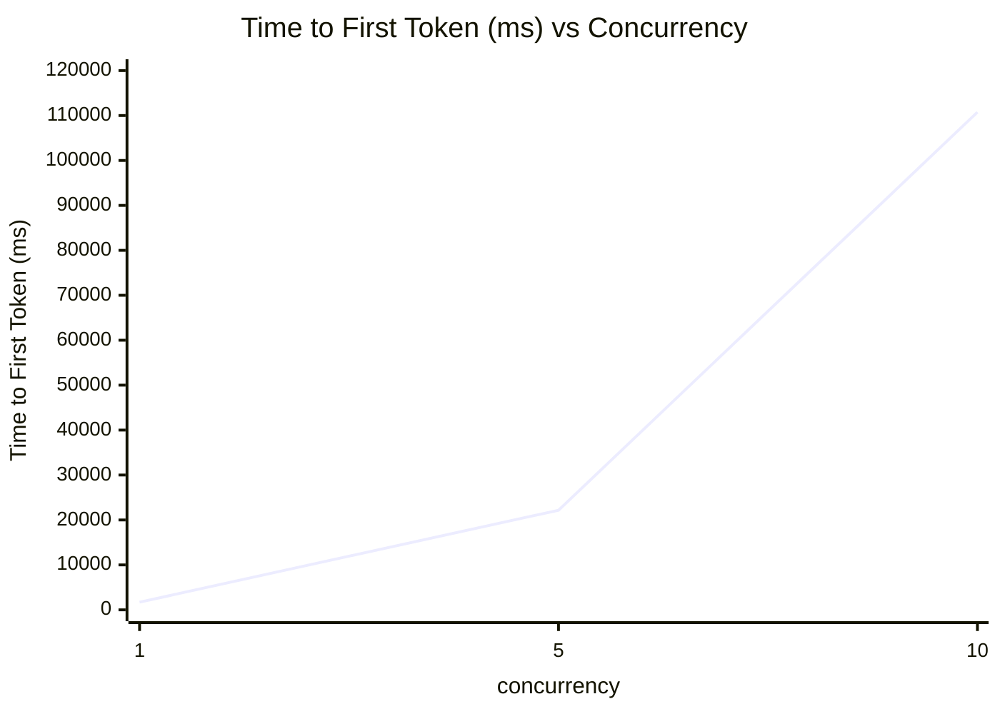
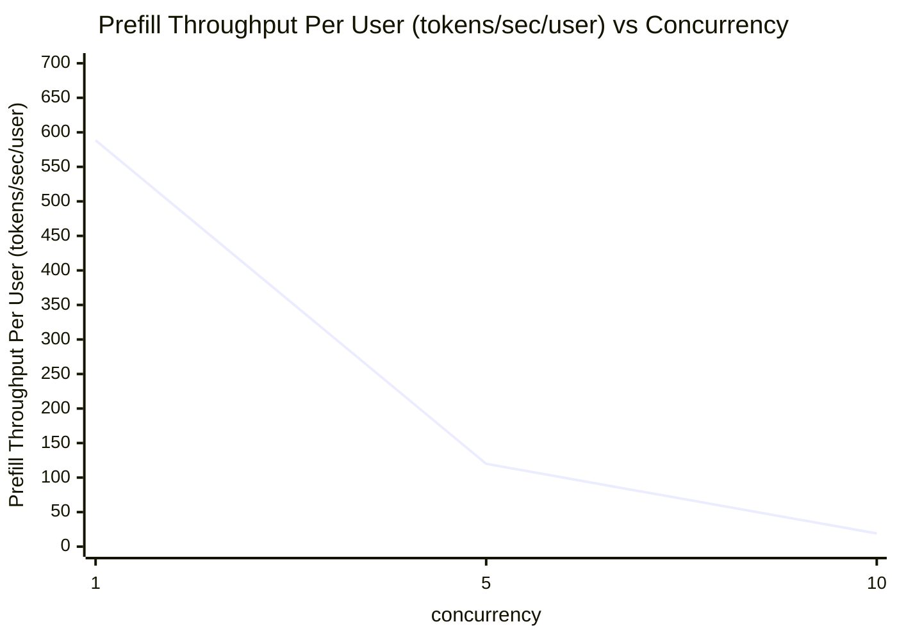
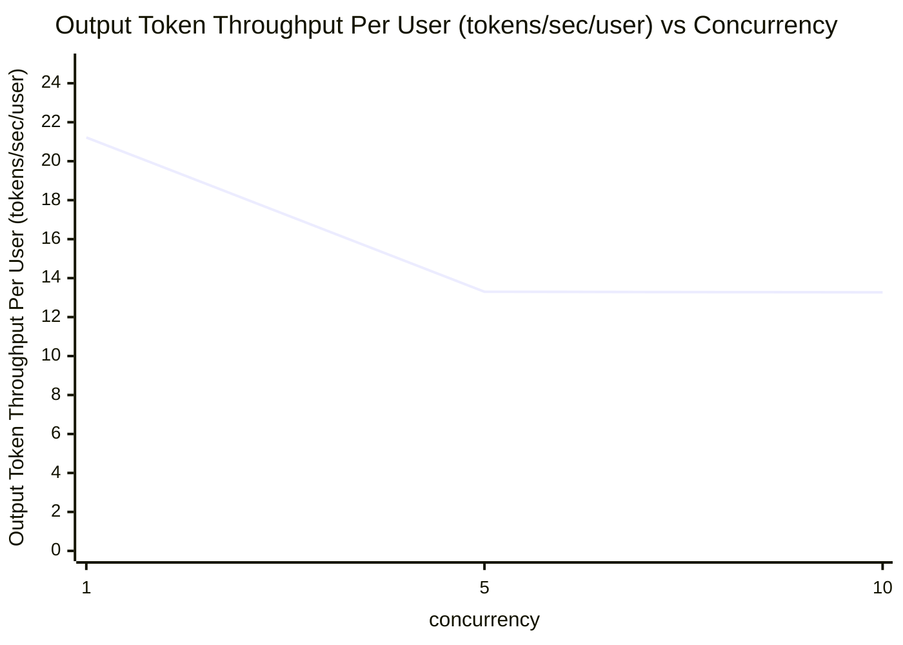
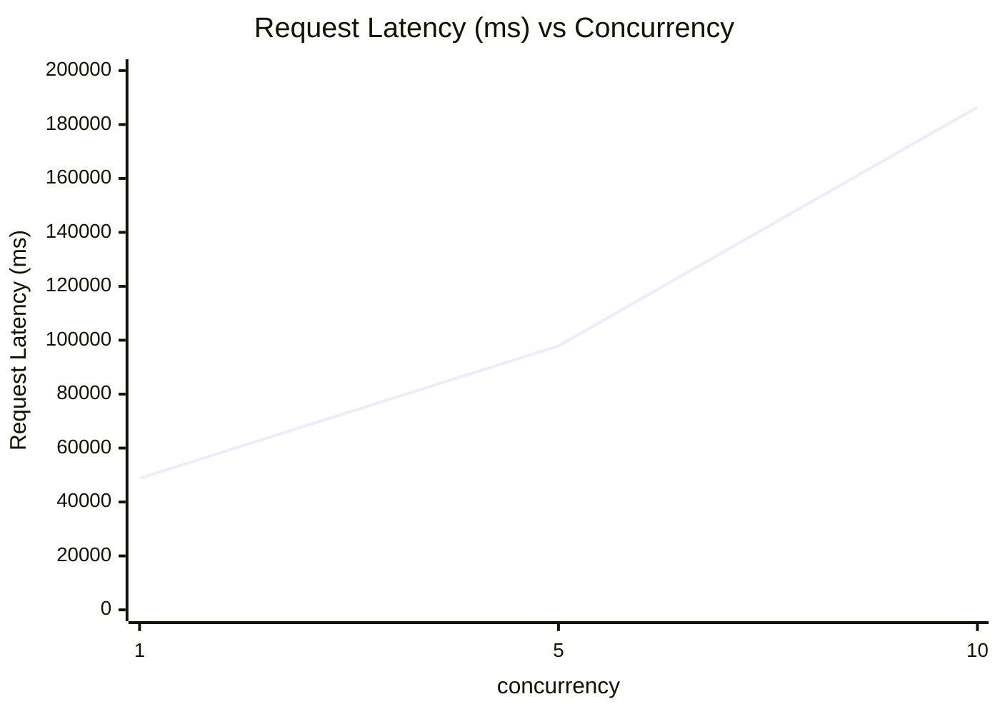

# Qwen3.6-27B 性能测试报告

> 测试模型：`unsloth-Qwen3.6-27B-MTP-GGUF-Qwen3.6-27B-UD-Q4_K_XL`
> 测试场景：ISL=1000, OSL=1000
> 并发档位：1 / 5 / 10

---

## 目录

1. [部署文档](#1-部署文档)
2. [性能测试脚本](#2-性能测试脚本)
3. [性能测试数据汇总](#3-性能测试数据汇总)
4. [Time to First Token (ms) — 并发数折线图](#4-time-to-first-token-ms--并发数折线图)
5. [Prefill Throughput Per User (tokens/sec/user) — 并发数折线图](#5-prefill-throughput-per-user-tokenssecuser--并发数折线图)
6. [Output Token Throughput Per User (tokens/sec/user) — 并发数折线图](#6-output-token-throughput-per-user-tokenssecuser--并发数折线图)
7. [Request Latency (ms) — 并发数折线图](#7-request-latency-ms--并发数折线图)

---

## 1. 部署文档

### 1.1 Qwen3.6-27B

```bash
./llama-server \
  -m /data/models/Qwen3.6-27B-Q4_K_M-GGUF/qwen3.6-27b-q4_k_m.gguf \
  --host 0.0.0.0 \
  --port 8000 \
  -ngl 999 \
  --ctx-size 8192 \
  --jinja
```

### 1.2 Qwen3.6-27B-MTP

```bash
./llama-server \
    --model /data/models/unsloth/Qwen3.6-27B-MTP-GGUF/Qwen3.6-27B-UD-Q4_K_XL.gguf \
    --alias "Qwen3.6-27B" \
    --temp 0.7 \
    --top-p 0.8 \
    --top-k 20 \
    --presence-penalty 1.5 \
    --min-p 0.00 \
    --spec-type draft-mtp --spec-draft-n-max 2 \
    --chat-template-kwargs '{"enable_thinking":false}'
```

### 1.3 后台执行

```bash
nohup /data/source_code/llama.cpp-master/build/bin/llama-server \
    --model /data/models/unsloth/Qwen3.6-27B-MTP-GGUF/Qwen3.6-27B-UD-Q4_K_XL.gguf \
    --alias "Qwen3.6-27B" \
    --host 0.0.0.0 \
    --port 8080 \
    --temp 0.7 \
    --top-p 0.8 \
    --top-k 20 \
    --presence-penalty 0.5 \
    --min-p 0.0 \
    --spec-type draft-mtp \
    --spec-draft-n-max 2 \
    --chat-template-kwargs '{"enable_thinking":false}' \
    > /var/log/llama-server.log 2>&1 &
```

### 1.4 调用示例

```bash
curl -X POST http://127.0.0.1:8080/v1/chat/completions \
  -H "Content-Type: application/json" \
  -d '{
    "model": "Qwen3.6-27B",
    "messages": [
      {"role": "user", "content": [
        {"type": "text", "text": "你是谁？"}
      ]}
    ],
    "max_tokens": 512,
    "stream": false
  }'
```

---

## 2. 性能测试脚本

> 文件路径：`ISL1000-OSL1000/perf_test.sh`

```bash
NIM_MODEL_NAME="Qwen3.6-27B"
MODEL_PATH="/data/models/unsloth/Qwen3.6-27B-NVFP4"
URL="http://127.0.0.1:8080"
ISL=1000
OSL=1000

# Function to run benchmark
run_benchmark() {
    local CONCURRENCY_COUNT=$1
    echo "========================================"
    echo "Starting benchmark with concurrency: $CONCURRENCY_COUNT"
    echo "Time: $(date '+%Y-%m-%d %H:%M:%S')"
    echo "========================================"

    aiperf profile \
      --model "$NIM_MODEL_NAME" \
      --tokenizer "$MODEL_PATH" \
      --endpoint-type chat \
      --streaming \
      --url "$URL" \
      --num-requests $((CONCURRENCY_COUNT * 5)) \
      --isl "$ISL" \
      --isl-stddev 0 \
      --osl "$OSL" \
      --osl-stddev 0 \
      --ui-type none \
      --concurrency "$CONCURRENCY_COUNT" \
      --extra-inputs "repetition_penalty:1.0" \
      --extra-inputs "temperature:0.0" \
      --extra-inputs ignore_eos:true \
      --num_dataset_entries $((CONCURRENCY_COUNT * 5)) \
      --no-server-metrics \
      --extra-inputs "min_tokens:40" \
      --tokenizer-trust-remote-code

    echo ""
    echo "Benchmark with concurrency $CONCURRENCY_COUNT completed at $(date '+%Y-%m-%d %H:%M:%S')"
    echo ""
}

# Run benchmarks for different concurrency levels
echo "Starting AI Performance Benchmark Suite"
echo "========================================"
echo ""

# 定义需要依次执行的并发档位
CONCURRENCY_LIST=(1 5 10)

# 循环逐个执行压测
for conc in "${CONCURRENCY_LIST[@]}"; do
    run_benchmark "${conc}"
done

echo "========================================"
echo "All benchmarks completed!"
echo "========================================"
```

**脚本说明：**

| 参数                                  | 说明                                                                                |
| ----------------------------------- | --------------------------------------------------------------------------------- |
| `NIM_MODEL_NAME`                    | 推理服务模型名（即 `--alias` 指定的别名）                                                        |
| `MODEL_PATH`                        | 用于分词器加载的本地模型路径                                                                    |
| `URL`                               | 推理服务地址                                                                            |
| `ISL` / `OSL`                       | 输入 / 输出 token 长度（均为 1000）                                                         |
| `--num-requests`                    | 单轮请求数，取 `并发数 × 5`                                                                 |
| `--concurrency`                     | 并发档位                                                                              |
| `--isl-stddev 0` / `--osl-stddev 0` | 序列长度无方差，固定长度                                                                      |
| `--no-server-metrics`               | 不采集服务端 GPU 指标                                                                     |
| `--extra-inputs`                    | 采样参数：`repetition_penalty=1.0`、`temperature=0.0`、`ignore_eos=true`、`min_tokens=40` |
| `CONCURRENCY_LIST`                  | 依次执行的并发档位列表：`1 5 10`                                                              |

---

## 3. 性能测试数据汇总

数据源：各并发文件夹下的 `profile_export_aiperf.csv`，提取 Metric 的 `avg` 值。

| concurrency | Input Sequence Length (tokens) | Output Sequence Length (tokens) | Time to First Token (ms) | Prefill Throughput Per User (tokens/sec/user) | Output Token Throughput Per User (tokens/sec/user) | Request Latency (ms) |
|:-----------:|:------------------------------:|:-------------------------------:|:------------------------:|:---------------------------------------------:|:--------------------------------------------------:|:--------------------:|
| 1           | 1000.00                        | 999.80                          | 1700.74                  | 588.41                                        | 21.22                                              | 48777.68             |
| 5           | 1000.00                        | 999.48                          | 22172.50                 | 119.92                                        | 13.30                                              | 97870.27             |
| 10          | 1000.00                        | 999.72                          | 110737.94                | 19.09                                         | 13.27                                              | 186461.69            |

---

## 4. Time to First Token (ms) — 并发数折线图

横坐标：并发数 `concurrency`
纵坐标：`Time to First Token (ms)` 的 avg 值
折线颜色：深蓝色（`#00008B`）



> Mermaid 颜色说明：`xychart-beta` 默认配色不直接支持自定义线条颜色。如需严格使用深蓝色，可使用以下 HTML 渲染方式。

<details>
<summary>HTML 版（深蓝色折线）</summary>

```html
<!DOCTYPE html>
<html>
<head>
<meta charset="utf-8">
<script src="https://cdn.jsdelivr.net/npm/chart.js"></script>
</head>
<body>
<canvas id="chart" width="800" height="500"></canvas>
<script>
const ctx = document.getElementById('chart').getContext('2d');
new Chart(ctx, {
  type: 'line',
  data: {
    labels: ['1', '5', '10'],
    datasets: [{
      label: 'Time to First Token (ms)',
      data: [1700.74, 22172.50, 110737.94],
      borderColor: '#00008B',
      backgroundColor: '#00008B',
      pointBackgroundColor: '#00008B',
      borderWidth: 2,
      tension: 0.1,
      fill: false
    }]
  },
  options: {
    scales: {
      x: { title: { display: true, text: 'concurrency' } },
      y: { title: { display: true, text: 'Time to First Token (ms)' } }
    }
  }
});
</script>
</body>
</html>
```

</details>

| concurrency | Time to First Token (ms) |
|:-----------:|:------------------------:|
| 1           | 1700.74                  |
| 5           | 22172.50                 |
| 10          | 110737.94                |

---

## 5. Prefill Throughput Per User (tokens/sec/user) — 并发数折线图

横坐标：并发数 `concurrency`
纵坐标：`Prefill Throughput Per User (tokens/sec/user)` 的 avg 值
折线颜色：深蓝色（`#00008B`）



<details>
<summary>HTML 版（深蓝色折线）</summary>

```html
<!DOCTYPE html>
<html>
<head>
<meta charset="utf-8">
<script src="https://cdn.jsdelivr.net/npm/chart.js"></script>
</head>
<body>
<canvas id="chart" width="800" height="500"></canvas>
<script>
const ctx = document.getElementById('chart').getContext('2d');
new Chart(ctx, {
  type: 'line',
  data: {
    labels: ['1', '5', '10'],
    datasets: [{
      label: 'Prefill Throughput Per User (tokens/sec/user)',
      data: [588.41, 119.92, 19.09],
      borderColor: '#00008B',
      backgroundColor: '#00008B',
      pointBackgroundColor: '#00008B',
      borderWidth: 2,
      tension: 0.1,
      fill: false
    }]
  },
  options: {
    scales: {
      x: { title: { display: true, text: 'concurrency' } },
      y: { title: { display: true, text: 'Prefill Throughput Per User (tokens/sec/user)' } }
    }
  }
});
</script>
</body>
</html>
```

</details>

| concurrency | Prefill Throughput Per User (tokens/sec/user) |
|:-----------:|:---------------------------------------------:|
| 1           | 588.41                                        |
| 5           | 119.92                                        |
| 10          | 19.09                                         |

---

## 6. Output Token Throughput Per User (tokens/sec/user) — 并发数折线图

横坐标：并发数 `concurrency`
纵坐标：`Output Token Throughput Per User (tokens/sec/user)` 的 avg 值
折线颜色：深蓝色（`#00008B`）



<details>
<summary>HTML 版（深蓝色折线）</summary>

```html
<!DOCTYPE html>
<html>
<head>
<meta charset="utf-8">
<script src="https://cdn.jsdelivr.net/npm/chart.js"></script>
</head>
<body>
<canvas id="chart" width="800" height="500"></canvas>
<script>
const ctx = document.getElementById('chart').getContext('2d');
new Chart(ctx, {
  type: 'line',
  data: {
    labels: ['1', '5', '10'],
    datasets: [{
      label: 'Output Token Throughput Per User (tokens/sec/user)',
      data: [21.22, 13.30, 13.27],
      borderColor: '#00008B',
      backgroundColor: '#00008B',
      pointBackgroundColor: '#00008B',
      borderWidth: 2,
      tension: 0.1,
      fill: false
    }]
  },
  options: {
    scales: {
      x: { title: { display: true, text: 'concurrency' } },
      y: { title: { display: true, text: 'Output Token Throughput Per User (tokens/sec/user)' } }
    }
  }
});
</script>
</body>
</html>
```

</details>

| concurrency | Output Token Throughput Per User (tokens/sec/user) |
|:-----------:|:--------------------------------------------------:|
| 1           | 21.22                                              |
| 5           | 13.30                                              |
| 10          | 13.27                                              |

---

## 7. Request Latency (ms) — 并发数折线图

横坐标：并发数 `concurrency`
纵坐标：`Request Latency (ms)` 的 avg 值
折线颜色：深蓝色（`#00008B`）



<details>
<summary>HTML 版（深蓝色折线）</summary>

```html
<!DOCTYPE html>
<html>
<head>
<meta charset="utf-8">
<script src="https://cdn.jsdelivr.net/npm/chart.js"></script>
</head>
<body>
<canvas id="chart" width="800" height="500"></canvas>
<script>
const ctx = document.getElementById('chart').getContext('2d');
new Chart(ctx, {
  type: 'line',
  data: {
    labels: ['1', '5', '10'],
    datasets: [{
      label: 'Request Latency (ms)',
      data: [48777.68, 97870.27, 186461.69],
      borderColor: '#00008B',
      backgroundColor: '#00008B',
      pointBackgroundColor: '#00008B',
      borderWidth: 2,
      tension: 0.1,
      fill: false
    }]
  },
  options: {
    scales: {
      x: { title: { display: true, text: 'concurrency' } },
      y: { title: { display: true, text: 'Request Latency (ms)' } }
    }
  }
});
</script>
</body>
</html>
```

</details>

| concurrency | Request Latency (ms) |
|:-----------:|:--------------------:|
| 1           | 48777.68             |
| 5           | 97870.27             |
| 10          | 186461.69            |

---

## 备注

- Mermaid `xychart-beta` 不原生支持自定义线条颜色；若要严格呈现深蓝色折线，请使用各小节中折叠的 HTML 版本（基于 Chart.js，已设置 `borderColor: '#00008B'` 深蓝色）。
- 数据源：`ISL1000-OSL1000/perf_results/Qwen3.6-27B-openai-chat-concurrency{1,5,10}/profile_export_aiperf.csv` 中的 `avg` 列。
