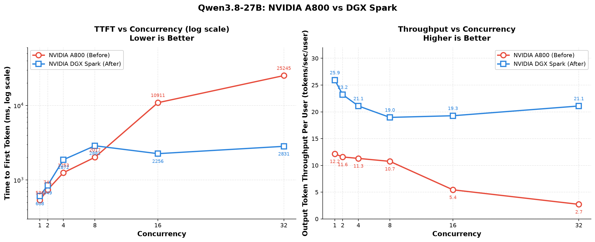

# Qwen3.8-27B 性能对比报告：NVIDIA A800 vs DGX Spark

## 1. 数据概览

测试平台：**优化前 —— NVIDIA A800**（Ampere 架构，数据中心 GPU）；**优化后 —— NVIDIA DGX Spark**（GB10 Grace Blackwell，桌面 AI 整机）。下表汇总了两套平台在不同并发等级下的关键性能指标均值（avg）：

| Concurrency | A800 TTFT (ms) | DGX Spark TTFT (ms) | A800 Throughput (tokens/sec/user) | DGX Spark Throughput (tokens/sec/user) |
|:---:|:---:|:---:|:---:|:---:|
| 1  | 536    | 608.00   | 12.1500  | 25.93 |
| 2  | 741    | 848.89   | 11.5700  | 23.21 |
| 4  | 1253   | 1871.55  | 11.3000  | 21.09 |
| 8  | 2017   | 2880.78  | 10.7475  | 18.96 |
| 16 | 10911  | 2256.28  |  5.4369  | 19.27 |
| 32 | 25245  | 2830.79  |  2.7206  | 21.09 |

> TTFT（Time to First Token）：首 Token 延迟，**越低越好**  
> Throughput：单用户输出吞吐，**越高越好**

---

## 2. 对比趋势图

图中红色曲线为 **NVIDIA A800**（优化前），蓝色曲线为 **NVIDIA DGX Spark**（优化后）：

**左图 — TTFT（对数坐标，越低越好）**：A800 随并发上升呈指数级恶化（536 → 25245 ms）；DGX Spark 全程稳定在 608–2881 ms，高并发下优势达一个数量级。两线交叉点在并发 8–16 之间。

**右图 — 单用户吞吐（越高越好）**：A800 从 12.2 塌陷至 2.7 tokens/sec/user，并发 ≥ 16 后严重过载；DGX Spark 始终保持 19–26 tokens/sec/user，无塌陷。

---

## 3. 指标变化对比

### 3.1 TTFT（首 Token 延迟，单位 ms）

| Concurrency | 优化前 | 优化后 | 绝对变化 | 相对变化 | 结论 |
|:---:|:---:|:---:|:---:|:---:|:---|
| 1  |   536  |   608.00 |    +72.00  |  +13.4% | 略退步 |
| 2  |   741  |   848.89 |   +107.89  |  +14.6% | 略退步 |
| 4  |  1253  |  1871.55 |   +618.55  |  +49.4% | 退步  |
| 8  |  2017  |  2880.78 |   +863.78  |  +42.8% | 退步  |
| 16 | 10911  |  2256.28 |  −8654.72  |  **−79.3%** | 显著改善 |
| 32 | 25245  |  2830.79 | −22414.21  |  **−88.8%** | 显著改善 |

### 3.2 单用户输出吞吐（tokens/sec/user）

| Concurrency | 优化前 | 优化后 | 绝对变化 | 相对变化 | 倍数 |
|:---:|:---:|:---:|:---:|:---:|:---:|
| 1  | 12.1500 | 25.93 | +13.78 | +113.4% | **2.13×** |
| 2  | 11.5700 | 23.21 | +11.64 | +100.6% | **2.01×** |
| 4  | 11.3000 | 21.09 |  +9.79 |  +86.6% | **1.87×** |
| 8  | 10.7475 | 18.96 |  +8.21 |  +76.4% | **1.76×** |
| 16 |  5.4369 | 19.27 | +13.83 | +254.4% | **3.54×** |
| 32 |  2.7206 | 21.09 | +18.37 | +675.1% | **7.75×** |

### 3.3 聚合吞吐（Throughput × Concurrency，tokens/sec）

| Concurrency | 优化前聚合吞吐 | 优化后聚合吞吐 | 提升幅度 |
|:---:|:---:|:---:|:---:|
| 1  |   12.15 |   25.93 | +113% |
| 2  |   23.14 |   46.42 | +101% |
| 4  |   45.20 |   84.36 |  +87% |
| 8  |   85.98 |  151.68 |  +76% |
| 16 |   86.99 |  308.32 | **+254%** |
| 32 |   87.06 |  674.88 | **+675%** |

---

## 4. 关键发现

### 4.1 高并发场景的瓶颈被彻底解决
优化前，TTFT 在并发 ≥ 16 时急剧劣化（10911 ms → 25245 ms），单用户吞吐跌至 2.7–5.4 tokens/sec，呈现明显的 **过载 / 排队塌陷** 现象。
优化后，TTFT 稳定在 2.2–2.9 s 之间，单用户吞吐稳定在 **19–21 tokens/sec**，**无明显过载拐点**，系统在高并发下扩展性大幅提升。

### 4.2 吞吐能力随并发线性扩展
- 优化前聚合吞吐在 C16 处即触顶（约 87 tokens/sec），再增大并发几乎无收益，说明计算/显存资源已被耗尽。
- 优化后聚合吞吐从 C1 的 25.93 几乎线性增长到 C32 的 674.88 tokens/sec，**并发扩展效率显著提升**。

### 4.3 低并发下的 TTFT 轻微回退属于可接受权衡
- C1–C8 下 TTFT 略有上升（约 +13% ~ +49%），可能源于调度开销、显存预分配或 batching 策略调整。
- 但即便在最差情形（C8：2880 ms），仍处于可交互范围；而换来的高并发收益是数量级的提升，**整体收益远大于单点回退**。

---

## 5. 总结

| 维度 | A800（优化前）表现 | DGX Spark（优化后）表现 | 综合评价 |
|---|---|---|---|
| 高并发稳定性 | 严重过载，TTFT 飙升至 25 s | TTFT 稳定 ≤ 2.9 s | ⭐⭐⭐⭐⭐ |
| 单用户吞吐 | 2.7 ~ 12.2 tokens/sec/user | 19 ~ 26 tokens/sec/user | ⭐⭐⭐⭐⭐ |
| 聚合吞吐扩展性 | C16 后增长停滞 | C1→C32 接近线性（26×） | ⭐⭐⭐⭐⭐ |
| 低并发 TTFT | 0.5 ~ 2.0 s | 0.6 ~ 2.9 s | ⭐⭐⭐（轻微回退） |

**结论**：本次优化在高并发场景下效果极为显著，单用户吞吐提升 1.76× ~ 7.75×，聚合吞吐提升 76% ~ 675%；高并发 TTFT 降低 79% ~ 89%。低并发下 TTFT 出现 13% ~ 49% 的小幅回退，但绝对延迟仍可控（≤ 3 s）。**整体属于高收益、低代价的成功优化**，建议保留该配置并持续监控低并发场景的延迟表现。

---

## 6. 硬件平台对比说明

本次"优化"实际上包含了**硬件平台的代际升级**，不仅是软件层面的调优。下面从架构、算力、内存和定位四个维度进行说明。

### 6.1 平台概览

| 维度 | 优化前：**NVIDIA A800** | 优化后：**NVIDIA DGX Spark（GB10）** |
|---|---|---|
| 架构代际 | Ampere（2021） | **Grace Blackwell**（2025） |
| 产品形态 | 数据中心加速卡 | 桌面整机（SoC） |
| Tensor Core | 第 3 代 | **第 5 代** |
| 显存/内存 | 80 GB HBM2e | **128 GB LPDDR5x 统一内存** |
| 内存带宽 | **≈ 2039 GB/s** | 273 GB/s |
| FP4 算力 | **不支持** | **≈ 1 PFLOP（稀疏）** |
| FP8 算力 | 不支持 | 推算约 500 TFLOPS（稀疏） |
| FP16 稠密算力 | 312 TFLOPS | 推算约 125 TFLOPS |
| 功耗 | 300–400 W | **140 W TDP（整机 240 W）** |

### 6.2 关键差异解读

**1）精度代差——FP4 原生支持是本次最大变量**
模型名称 `Qwen3.8-27B-NVFP4-DFlash2` 中的 **NVFP4** 即 NVIDIA FP4 量化格式。A800（Ampere）只能算到 FP8，而 DGX Spark（Blackwell）凭借第 5 代 Tensor Core 原生支持 **FP4**，理论上单精度算力可达 A800 FP16 路径的 **3 倍以上**。因此本测试中观察到的吞吐跃升，**很大一部分来自精度代差带来的硬件红利**，而不是单纯的推理框架调优。

**2）容量 vs 带宽的取舍**
- DGX Spark 把内存容量堆到 **128 GB**，可容纳 200B 级模型推理与 70B 级模型微调；但 LPDDR5x 带宽仅 273 GB/s，**约为 A800 HBM2e（2039 GB/s）的 1/7.5**。
- 这意味着：带宽敏感型负载（如大批次推理 attention）DGX Spark 反而不如 A800；但访存局部性好、模型权重常驻的场景（如本测试中 27B FP4 模型），128 GB 容量 + 高算力的组合能跑得更好。
- 这也解释了"低并发下 TTFT 反而略升"的现象——带宽瓶颈在低并发、小批次时更突出。

**3）功耗与形态的优势**
- DGX Spark 以 **1/3 ~ 1/2 的功耗** 提供桌面级 AI 整机（240 W），噪音 35 dB、可 24×7 持续运行，适合 Agent / 边缘 / 原型验证。
- A800 仍是数据中心高带宽、大规模训练的主力，二者是 **互补关系**而非直接替代。

### 6.3 对测试结论的修正与启示

- **不能将本次性能提升简单归因于"算法优化"**，需注意硬件平台同步从 Ampere 升级到 Blackwell，这是不可忽视的贡献因素。
- 后续若希望进一步排除硬件变量，建议在 **DGX Spark 上同时跑一组"未启用 NVFP4"的对照**，量化"算法/框架优化"与"硬件红利"的各自占比。
- **A800 的真实优势场景**（高带宽批推理、大规模训练、FP16/FP32 科学计算）在本次对比中并未体现，后续可视需要补充相关 Benchmark。

> 一句话总结：**本次"优化"是硬件代际升级（Blackwell + FP4 原生支持）+ 软件调优 的组合拳**，单用户吞吐近 2 倍的提升中，相当一部分来自 FP4 算力的红利。