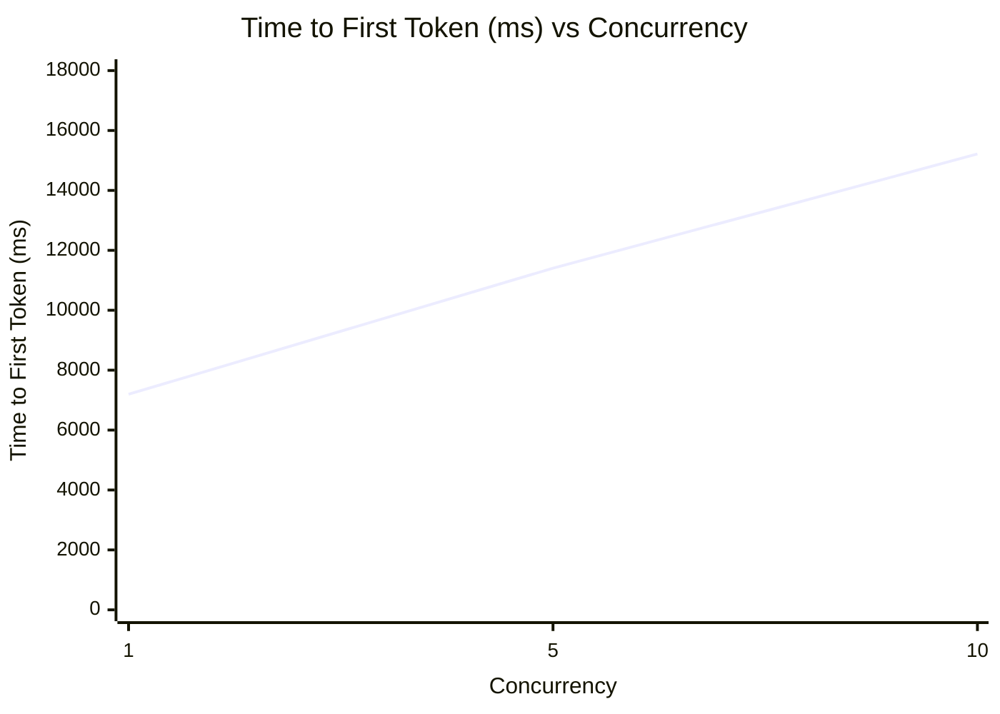
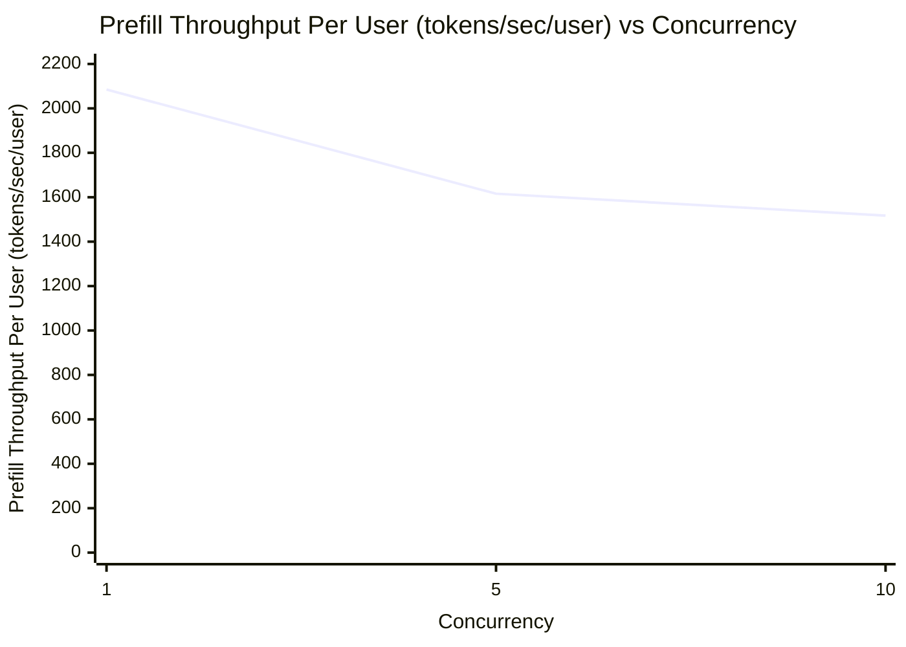
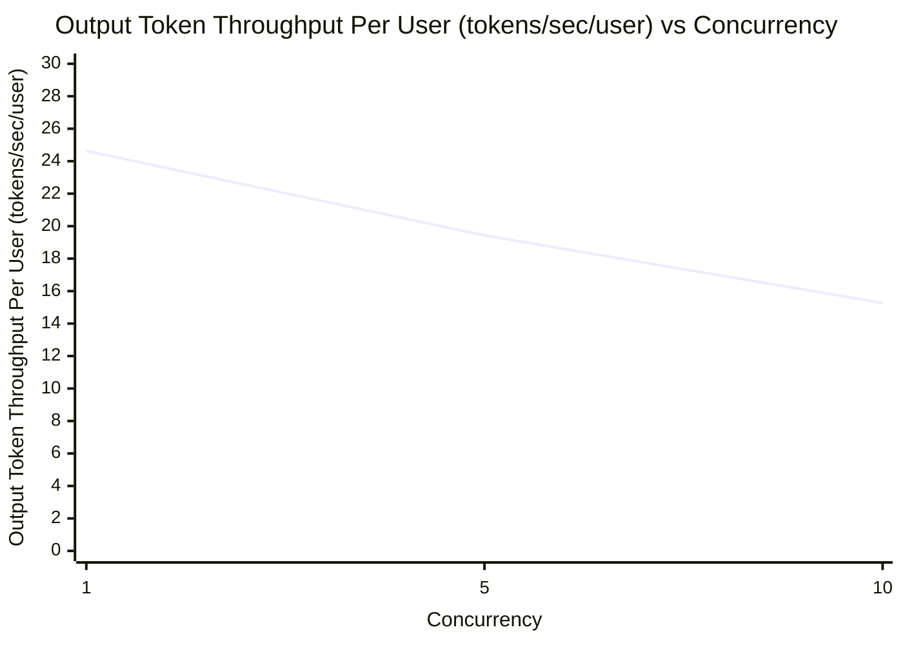
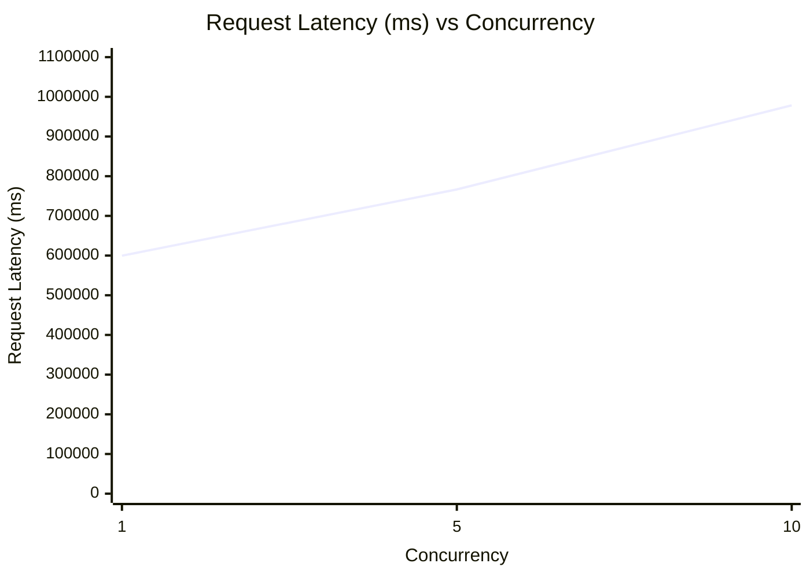

# Qwen3.6-27B-NVFP4 性能测试报告

> **ISL (Input Sequence Length):** 15000 tokens  
> **OSL (Output Sequence Length):** 15000 tokens  
> **模型:** unsloth/Qwen3.6-27B-NVFP4  
> **推理镜像:** nvcr.io/nvidia/vllm:26.07-py3  

---

## 目录

1. [性能测试结果汇总表](#1-性能测试结果汇总表)
2. [Time to First Token (ms) vs 并发数](#2-time-to-first-token-ms-vs-并发数)
3. [Prefill Throughput Per User (tokens/sec/user) vs 并发数](#3-prefill-throughput-per-user-tokenssecuser-vs-并发数)
4. [Output Token Throughput Per User (tokens/sec/user) vs 并发数](#4-output-token-throughput-per-user-tokenssecuser-vs-并发数)
5. [Request Latency (ms) vs 并发数](#5-request-latency-ms-vs-并发数)
6. [推理服务部署文档](#6-推理服务部署文档)
7. [性能测试脚本](#7-性能测试脚本)

---

## 1. 性能测试结果汇总表

| concurrency | Input Sequence Length (tokens) | Output Sequence Length (tokens) | Time to First Token (ms) | Prefill Throughput Per User (tokens/sec/user) | Output Token Throughput Per User (tokens/sec/user) | Request Latency (ms) |
|:-----------:|:------------------------------:|:-------------------------------:|:------------------------:|:--------------------------------------------:|:-------------------------------------------------:|:--------------------:|
| 1           | 15000.00                       | 14590.80                        | 7195.21                  | 2084.74                                     | 24.63                                             | 599636.36            |
| 5           | 15000.00                       | 14660.40                        | 11403.14                 | 1615.93                                     | 19.43                                             | 766635.46            |
| 10          | 15000.02                       | 14702.20                        | 15216.04                 | 1517.43                                     | 15.27                                             | 978561.67            |

---

## 2. Time to First Token (ms) vs 并发数



> **图表说明：** 折线使用深蓝色，横坐标为并发数 concurrency，纵坐标为 Time to First Token (ms)。

| concurrency | Time to First Token (ms) |
|:-----------:|:------------------------:|
| 1           | 7195.21                  |
| 5           | 11403.14                 |
| 10          | 15216.04                 |

---

## 3. Prefill Throughput Per User (tokens/sec/user) vs 并发数



> **图表说明：** 折线使用深蓝色，横坐标为并发数 concurrency，纵坐标为 Prefill Throughput Per User (tokens/sec/user)。

| concurrency | Prefill Throughput Per User (tokens/sec/user) |
|:-----------:|:---------------------------------------------:|
| 1           | 2084.74                                      |
| 5           | 1615.93                                      |
| 10          | 1517.43                                      |

---

## 4. Output Token Throughput Per User (tokens/sec/user) vs 并发数



> **图表说明：** 折线使用深蓝色，横坐标为并发数 concurrency，纵坐标为 Output Token Throughput Per User (tokens/sec/user)。

| concurrency | Output Token Throughput Per User (tokens/sec/user) |
|:-----------:|:--------------------------------------------------:|
| 1           | 24.63                                              |
| 5           | 19.43                                              |
| 10          | 15.27                                              |

---

## 5. Request Latency (ms) vs 并发数



> **图表说明：** 折线使用深蓝色，横坐标为并发数 concurrency，纵坐标为 Request Latency (ms)。

| concurrency | Request Latency (ms) |
|:-----------:|:--------------------:|
| 1           | 599636.36            |
| 5           | 766635.46            |
| 10          | 978561.67            |

---

## 6. 推理服务部署文档

### 推理镜像

```
nvcr.io/nvidia/vllm:26.07-py3
```

### 模型权重

```
/data/models/unsloth/Qwen3.6-27B-NVFP4
```

### 启动命令

```bash
docker run -it --rm \
  --gpus all \
  -p 8000:8000 \
  -v /data/models/unsloth/Qwen3.6-27B-NVFP4:/model \
  nvcr.io/nvidia/vllm:26.07-py3 \
  vllm serve \
    --model /model \
    --served-model-name Qwen3.6-27B \
    --host 0.0.0.0 \
    --port 8000 \
    --tensor-parallel-size 1 \
    --max-model-len 100000 \
    --gpu-memory-utilization 0.7 \
    --speculative-config '{"method": "mtp", "num_speculative_tokens": 2}'
```

#### 参数说明

| 参数 | 值 | 说明 |
|:----|:---|:-----|
| `--model` | `/model` | 模型权重挂载路径 |
| `--served-model-name` | `Qwen3.6-27B` | 对外提供的服务模型名 |
| `--host` | `0.0.0.0` | 绑定所有网络接口 |
| `--port` | `8000` | 服务监听端口 |
| `--tensor-parallel-size` | `1` | 张量并行大小（单卡） |
| `--max-model-len` | `100000` | 模型最大上下文长度 |
| `--gpu-memory-utilization` | `0.7` | GPU 显存利用率上限 |
| `--speculative-config` | `{"method": "mtp", "num_speculative_tokens": 2}` | 投机解码配置，MTP 方法，2 个投机 token |

---

## 7. 性能测试脚本

### 脚本概述

性能测试脚本使用 `aiperf profile` 工具对推理服务进行压测，依次在并发数 1、5、10 三个档位下执行基准测试。

### 变量配置

```bash
NIM_MODEL_NAME="Qwen3.6-27B"
MODEL_PATH="/data/models/unsloth/Qwen3.6-27B-NVFP4"
URL="http://127.0.0.1:8000"
ISL=15000
OSL=15000
```

### 完整脚本

```bash
NIM_MODEL_NAME="Qwen3.6-27B"
MODEL_PATH="/data/models/unsloth/Qwen3.6-27B-NVFP4"
URL="http://127.0.0.1:8000"
ISL=15000
OSL=15000

# Function to run benchmark
run_benchmark() {
    local CONCURRENCY_COUNT=$1
    echo "========================================"
    echo "Starting benchmark with concurrency: $CONCURRENCY_COUNT"
    echo "Time: $(date '+%Y-%m-%d %H:%M:%S')"
    echo "========================================"

    aiperf profile \
      --model "$NIM_MODEL_NAME" \
      --tokenizer "$MODEL_PATH" \
      --endpoint-type chat \
      --streaming \
      --url "$URL" \
      --num-requests $((CONCURRENCY_COUNT * 5)) \
      --isl "$ISL" \
      --isl-stddev 0 \
      --osl "$OSL" \
      --osl-stddev 0 \
      --ui-type none \
      --concurrency "$CONCURRENCY_COUNT" \
      --extra-inputs "repetition_penalty:1.0" \
      --extra-inputs "temperature:0.0" \
      --extra-inputs ignore_eos:true \
      --num_dataset_entries $((CONCURRENCY_COUNT * 5)) \
      --no-server-metrics \
      --extra-inputs "min_tokens:40" \
      --tokenizer-trust-remote-code

    echo ""
    echo "Benchmark with concurrency $CONCURRENCY_COUNT completed at $(date '+%Y-%m-%d %H:%M:%S')"
    echo ""
}

# Run benchmarks for different concurrency levels
echo "Starting AI Performance Benchmark Suite"
echo "========================================"
echo ""

# 定义需要依次执行的并发档位
CONCURRENCY_LIST=(1 5 10)

# 循环逐个执行压测
for conc in "${CONCURRENCY_LIST[@]}"; do
    run_benchmark "${conc}"
done

echo "========================================"
echo "All benchmarks completed!"
echo "========================================"
```

### 关键参数说明

| 参数 | 说明 |
|:----|:-----|
| `--model` | 指定推理服务模型名 |
| `--tokenizer` | 指定 tokenizer 路径 |
| `--endpoint-type` | 端点类型（chat） |
| `--streaming` | 启用流式输出 |
| `--url` | 推理服务地址 |
| `--num-requests` | 总请求数（并发数 × 5） |
| `--isl` / `--isl-stddev` | 输入序列长度及标准差（15000 / 0） |
| `--osl` / `--osl-stddev` | 输出序列长度及标准差（15000 / 0） |
| `--concurrency` | 并发请求数 |
| `--extra-inputs` | 附加推理参数（repetition_penalty、temperature、ignore_eos、min_tokens） |
| `--num_dataset_entries` | 数据集条目数 |
| `--no-server-metrics` | 不收集服务端指标 |
| `--tokenizer-trust-remote-code` | 信任远程 tokenizer 代码 |

### 测试流程

1. 定义模型名、权重路径、服务地址、ISL/OSL 等全局变量。
2. 定义 `run_benchmark` 函数，接收并发数参数并调用 `aiperf profile` 执行压测。
3. 按并发档位列表 `(1 5 10)` 依次循环执行压测。
4. 每轮压测开始和结束时打印时间戳。
5. 全部完成后输出结束日志。
